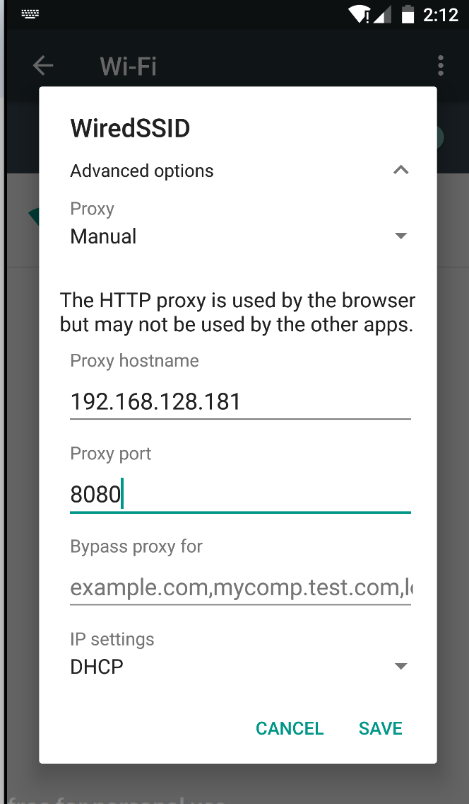
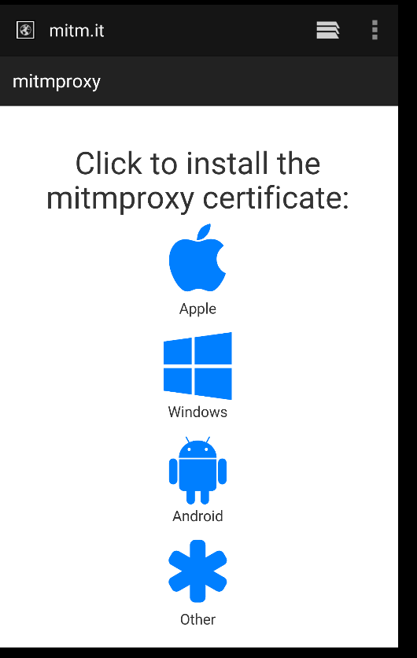
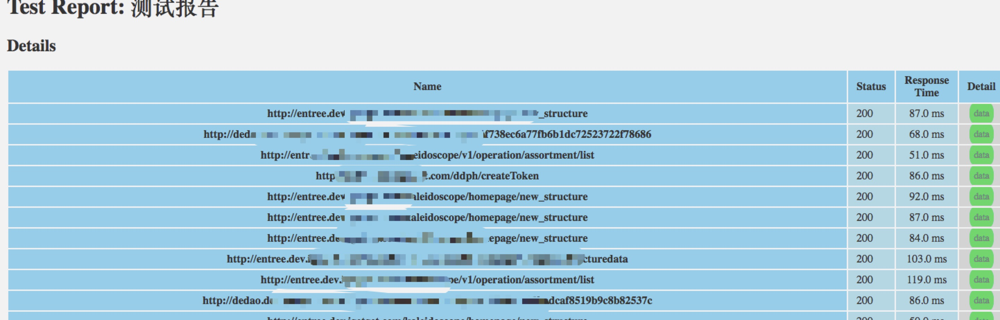
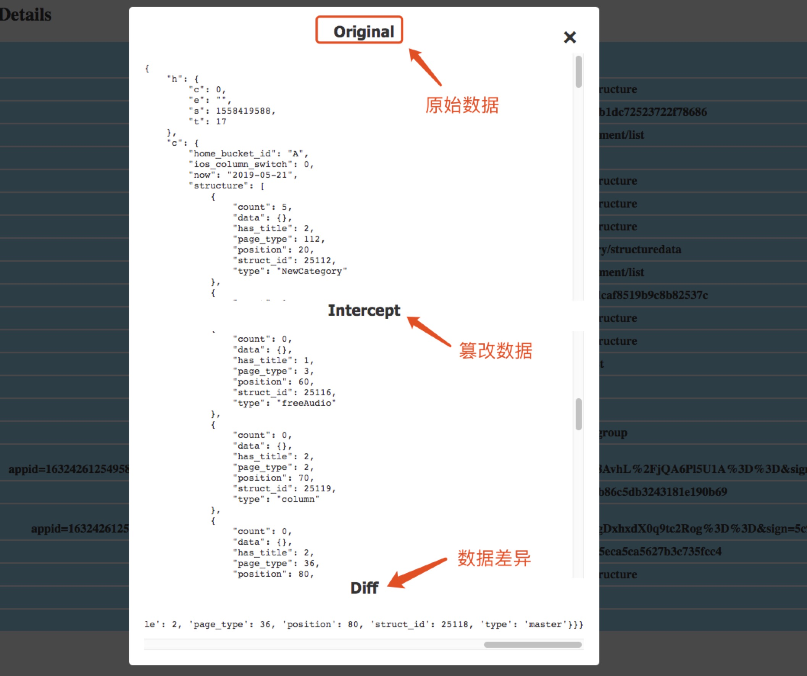

# 介绍

使用mitproxy代理工具做自动化Mock数据测试,来验证移动端app对数据的容错性.


# 环境搭建

## 创建虚拟环境(python 3.7)
```angularjs
python3.7 -m venv tutorial-env  

source tutorial-env/bin/activate (创建虚拟环境)

deactivate (退出虚拟环境)
```

## 安装依赖
```angular2html
pip3 install mitmproxy

pip3 install jsonpath-rw

pip3 install colorama

pip3 install colorlog
```


# 规则
```
随机对请求数据做随机拦截篡改,支持事件如下:
1.随机对返回value做修改/删除
2.随机对返回list做删除 （可能会引起客户端崩溃,慎用）
3.随机对返回接口状态码修改
4.随机对返回接口时间做延迟修改
```


## 使用

### 手机连接代理
移动设备和电脑保存在一个wifi网络下,在移动设备在网络代理填写电脑ip+8080(端口)



###  mitproxy https证书安装
```
在浏览器输入:mitm.it,选择Android证书下载并安装
```



### 执行mock数据
```angularjs
mitmdump -s proxyserver.py
或者
mitmweb -s proxyserver.py
```


### 生成报告
```angularjs
参数1:需要保存的报告地址
参数2:保存到本地篡改数据地址
python genhtml.py ~/PycharmProjects/mitmproxytest/proxy ~/PycharmProjects/mitmproxytest/proxy/20190521143711_intercept.log
```

# 展示






# 参考
mitmproxy的github<br>
https://github.com/mitmproxy/mitmproxy.git<br>